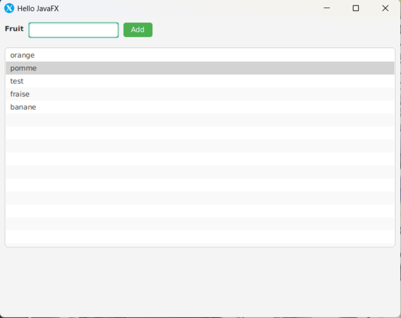

# My first javaFx app

Il s'agit d'une simple application JavaFX qui permet à l'utilisateur d'ajouter des fruits à une liste. Ce projet utilise JavaFX pour l'interface utilisateur et Maven pour la gestion des dépendances.

## Fonctionnalités

- Ajouter des fruits à une liste via un champ de texte.
- Afficher la liste des fruits ajoutés.
- Interface utilisateur stylisée avec CSS.

## Prérequis

- **Java 11** ou une version ultérieure.
- **Maven** pour la gestion des dépendances.
- **JavaFX 13** (géré automatiquement via Maven).

## Prérequis

- **Java 11** ou une version ultérieure.
- **Maven** pour la gestion des dépendances.
- **JavaFX 13** (géré automatiquement via Maven).

## Installation et exécution

1. Clonez le dépôt :
   ```bash
   git clone https://github.com/42yasuke/myFirstJavaFXApp
   cd myFirstJavaFXApp
   ```

2. Compilez et exécutez le projet avec Maven :
	```bash
	mvn clean javafx:run
	```

3. L'application se lancera avec une fenêtre contenant un champ de texte, 
   un bouton "Add", et une liste.

<div align="center">

</div>
